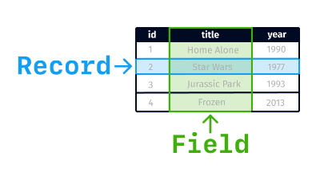

# SQL

## Records and Fields



rows are records and columns are fields

## Comments

```sql
-- This is a comment

/*
This is a
block comment
*/
```

## Sort (ORDER BY)

```sql
SELECT *
FROM movies
ORDER BY year ASC -- ascending by default (123)
```

```sql
SELECT *
FROM movies
ORDER BY year DESC -- descending (321)
```

## Limit (LIMIT)

```sql
SELECT *
FROM movies
LIMIT 10
```

## Skip Records (OFFSET)

```sql
SELECT *
FROM movies
LIMIT 3 OFFSET 2
```

## Alias (AS)

```sql
SELECT movie_title AS title
FROM movies
```
